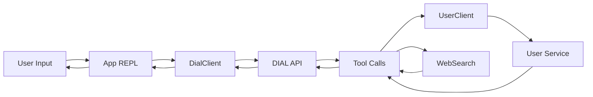

# DIAL Simple Agent

> AI-powered conversational agent for user management using EPAM's DIAL API proxy with integrated tool calling

## 🎯 Project Overview

DIAL Simple Agent is a Python-based AI agent implementation that connects to EPAM's DIAL (Distributed AI Lab) proxy service to provide natural language user management capabilities. The agent demonstrates practical integration of OpenAI-compatible API with custom tools for CRUD operations on a mock user service.

### Key Features

- **DIAL API Integration**: OpenAI-compatible chat completions with EPAM's AI proxy
- **Tool Calling System**: Abstract tool framework with user service and web search tools
- **Agentic Behavior**: Recursive tool invocation for multi-step task execution
- **Conversation Management**: Maintains context across multi-turn interactions
- **Mock User Service**: Dockerized service with 1000 pre-generated users
- **Production-Ready Patterns**: Dataclass-based models, Pydantic validation, error handling

### Use Cases

- Learning AI agent development with real-world API integration
- Building conversational interfaces for CRUD applications
- Understanding tool calling patterns in LLM applications
- Exploring EPAM's DIAL proxy service capabilities

## 📚 Documentation Structure

| Document | Description |
|----------|-------------|
| [Architecture](./architecture.md) | System design, component interactions, data flow diagrams |
| [Setup Guide](./setup.md) | Environment configuration, dependencies, Docker setup |
| [API Reference](./api.md) | DIAL endpoint details, tool schemas, message formats |
| [Testing Guide](./testing.md) | Test strategy, manual testing procedures, validation |
| [Glossary](./glossary.md) | Domain terms, acronyms, technical vocabulary |
| [ADRs](./adr/) | Architecture decision records documenting key choices |

## 🚀 Quick Start

### Prerequisites

- Python 3.11+
- Docker and Docker Compose
- EPAM VPN connection
- DIAL API key ([request here](https://support.epam.com/ess?id=sc_cat_item&table=sc_cat_item&sys_id=910603f1c3789e907509583bb001310c))

### 5-Minute Setup

```bash
# 1. Activate the included virtual environment
source dial_simple_agent/bin/activate

# 2. Start the mock user service
docker-compose up -d userservice

# 3. Export your DIAL API key
export DIAL_API_KEY="your-api-key-here"

# 4. Run the agent
python -m task.app
```

See [Setup Guide](./setup.md) for detailed configuration options.

## 💡 Example Interaction

```
User Management Agent started. Type 'exit' or 'quit' to stop.
============================================================
> Find users named John
```

**Agent Response:**
```
Found 3 users named John:

1. John Smith (john.smith@example.com)
2. John Doe (john.doe@example.com)
3. Johnathan Williams (j.williams@example.com)
```

```
> Update John Smith's email to john.smith@newdomain.com
```

**Agent Response:**
```
✓ Updated user successfully. New details:
  name: John Smith
  email: john.smith@newdomain.com
  phone: +1-555-1234
```

## 🏗️ Architecture Highlights



The agent implements an **agentic loop**:
1. User sends natural language request
2. DIAL API determines which tools to invoke
3. Tools execute and return results
4. Results are sent back to DIAL for synthesis
5. Final response returned to user

See [Architecture](./architecture.md) for detailed system design.

## 📦 Project Structure

```
task/
├── models/           # Message, conversation, and role dataclasses
├── tools/            # Tool system with base abstractions
│   ├── base.py       # BaseTool abstract interface
│   ├── web_search.py # Google Search via DIAL
│   └── users/        # User service CRUD tools
├── client.py         # DIAL API client implementation
├── prompts.py        # System prompt definitions
└── app.py            # Main entry point with REPL

dial_simple_agent/    # Pre-configured virtual environment
docker-compose.yml    # User service container definition
requirements.txt      # Dependencies (requests, pydantic)
```

## 🔗 Integration Points

### DIAL API
- **Endpoint**: `https://ai-proxy.lab.epam.com`
- **Format**: OpenAI chat completions with tools
- **Models**: gpt-4o, gemini-2.5-pro
- **Authentication**: API key via header

### User Service
- **Base URL**: `http://localhost:8041`
- **API Version**: v1
- **Endpoints**: CRUD operations on `/v1/users/`
- **Data**: 1000 pre-generated mock users

## 🛠️ Development Workflow

1. **Implement Tool**: Extend `BaseTool` or `BaseUserServiceTool`
2. **Register Tool**: Add to tools list in `app.py`
3. **Test Integration**: Run agent and test natural language queries
4. **Iterate**: Refine tool descriptions and schemas based on LLM behavior

See [API Reference](./api.md) for tool implementation patterns.

## 📖 Learning Resources

- [DIAL API Documentation](https://dialx.ai/dial_api)
- [OpenAI Function Calling Guide](https://platform.openai.com/docs/guides/function-calling)
- [Pydantic Models](https://docs.pydantic.dev/)

## 🤝 Contributing

This is a learning project. Contributions welcome:
- Add new tools (email notifications, calendar integration, etc.)
- Improve error handling and user feedback
- Add unit tests and integration tests
- Enhance documentation with more examples

## 📝 License

TODO: requires confirmation

## 🔍 Troubleshooting

| Issue | Solution |
|-------|----------|
| "API key is required" | Export `DIAL_API_KEY` environment variable |
| Connection timeout | Connect to EPAM VPN |
| User service unavailable | Run `docker-compose up -d userservice` |
| Tool not found | Verify tool is registered in `app.py` tools list |

See [Setup Guide](./setup.md#troubleshooting) for more details.

## 📞 Support

- Internal DIAL Support: [Service Portal](https://support.epam.com/ess)
- Project Issues: TODO: requires confirmation

---

**Last Updated**: 2025-12-30 | **Version**: 1.0.0
