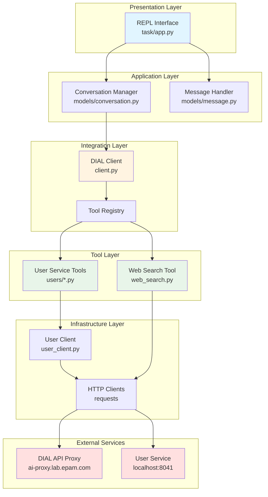
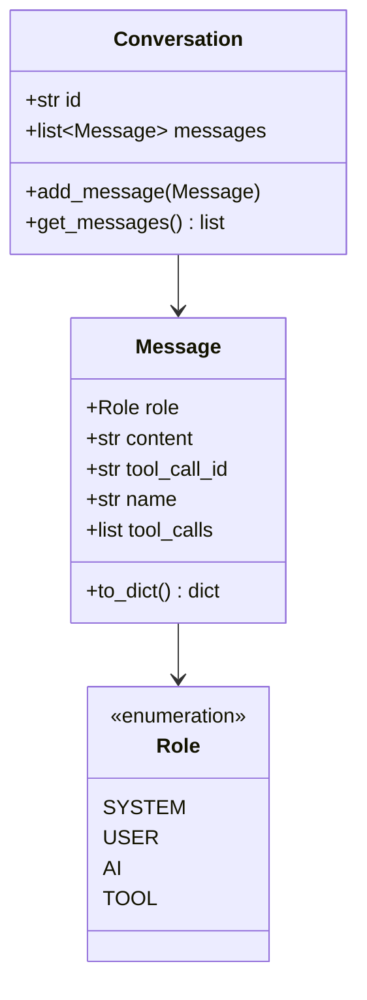
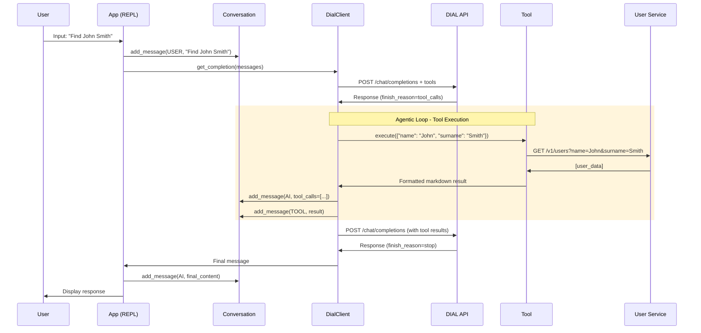
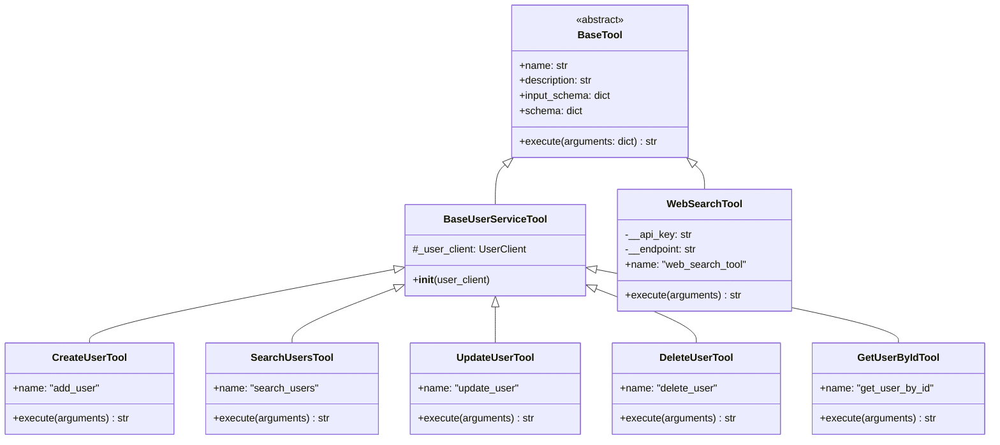
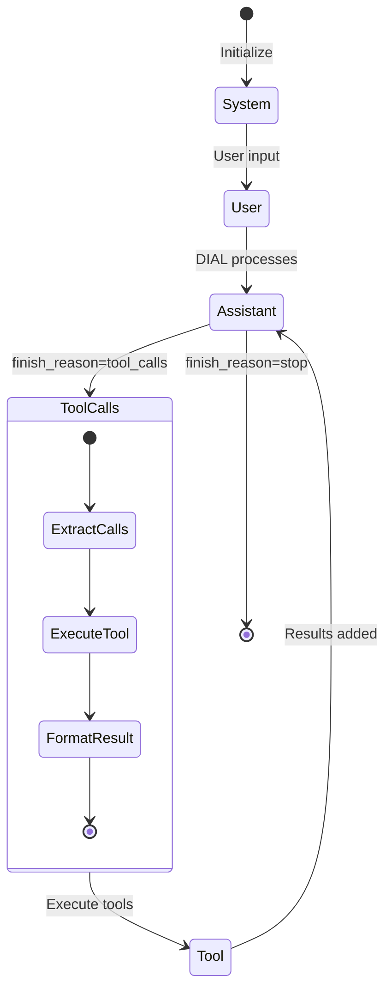
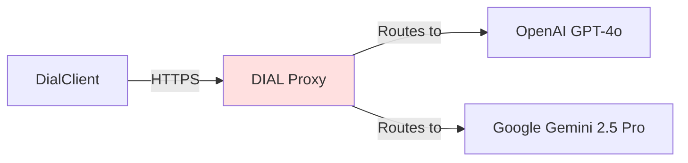
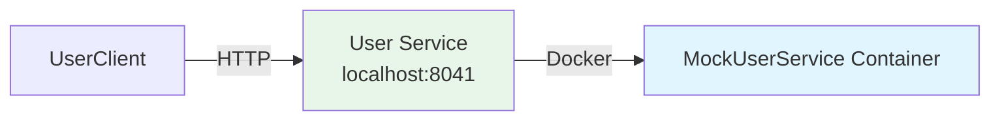

# Architecture

> Comprehensive system design for the DIAL Simple Agent implementation

## Table of Contents

- [System Overview](#system-overview)
- [Component Architecture](#component-architecture)
- [Data Flow](#data-flow)
- [Agentic Loop Pattern](#agentic-loop-pattern)
- [Tool System Design](#tool-system-design)
- [Message Flow](#message-flow)
- [Integration Points](#integration-points)
- [Design Decisions](#design-decisions)
- [Constraints and Limitations](#constraints-and-limitations)

## System Overview

DIAL Simple Agent implements a **conversational AI agent** with tool calling capabilities. The architecture follows a layered approach with clear separation of concerns:



### Architectural Layers

| Layer | Purpose | Components |
|-------|---------|------------|
| **Presentation** | User interaction | REPL loop, input/output formatting |
| **Application** | Business logic | Conversation management, message routing |
| **Integration** | External communication | DIAL API client, tool orchestration |
| **Tool** | Capabilities | User CRUD tools, web search tool |
| **Infrastructure** | Low-level I/O | HTTP clients, data serialization |

## Component Architecture

### Core Components

#### 1. DialClient (`task/client.py`)

**Responsibilities:**
- Manage DIAL API communication
- Tool schema registration
- Recursive tool calling orchestration
- Error handling and retry logic

**Key Methods:**
```python
def get_completion(messages: list[Message]) -> Message:
    """
    Agentic loop implementation:
    1. Send messages to DIAL API
    2. Check finish_reason
    3. If tool_calls: execute tools, recurse
    4. If stop: return final message
    """
```

**Design Pattern**: Recursive composition for agentic behavior

#### 2. BaseTool (`task/tools/base.py`)

**Responsibilities:**
- Define tool contract via abstract methods
- Generate OpenAI-compatible function schemas
- Enforce consistent tool interface

**Interface:**
```python
class BaseTool(ABC):
    @abstractmethod
    def execute(arguments: dict) -> str: ...
    
    @property
    @abstractmethod
    def name() -> str: ...
    
    @property
    @abstractmethod
    def description() -> str: ...
    
    @property
    @abstractmethod
    def input_schema() -> dict: ...
```

**Design Pattern**: Template Method pattern with abstract properties

#### 3. UserClient (`task/tools/users/user_client.py`)

**Responsibilities:**
- HTTP communication with user service
- Response formatting (dict → markdown)
- Request serialization (Pydantic → JSON)

**Key Features:**
- Markdown formatting for LLM readability
- Consistent error propagation
- Optional parameter handling

#### 4. Conversation & Message (`task/models/`)

**Responsibilities:**
- Maintain conversation history
- Message serialization to OpenAI format
- Support for multiple message types (system, user, assistant, tool)

**Message Types:**


## Data Flow

### Request-Response Cycle



### Tool Invocation Flow

```mermaid
flowchart TD
    Start([DIAL API Response]) --> Check{finish_reason?}
    Check -->|tool_calls| Extract[Extract tool_calls]
    Check -->|stop| Return[Return message]
    
    Extract --> Loop{For each tool_call}
    Loop --> Lookup[Lookup tool by name]
    Lookup --> Found{Tool found?}
    Found -->|Yes| Execute[tool.execute(args)]
    Found -->|No| Error[Return error message]
    
    Execute --> Format[Format as tool message]
    Error --> Format
    Format --> AddMsg[Add to conversation]
    
    AddMsg --> MoreTools{More tools?}
    MoreTools -->|Yes| Loop
    MoreTools -->|No| Recurse[Recursive get_completion]
    
    Recurse --> Check
    Return --> End([Return to caller])
    
    style Extract fill:#e1f5ff
    style Execute fill:#e8f5e9
    style Recurse fill:#fff4e1
```

## Agentic Loop Pattern

The core architectural pattern is the **recursive agentic loop** that enables multi-step reasoning:

### Pattern Implementation

```python
def get_completion(messages: list[Message]) -> Message:
    """Recursive agentic loop implementation"""
    # 1. Send request to DIAL API
    response = send_request(messages)
    
    # 2. Check termination condition
    if response.finish_reason == "stop":
        return response.message
    
    # 3. Execute tools if requested
    if response.finish_reason == "tool_calls":
        tool_results = []
        for tool_call in response.tool_calls:
            result = execute_tool(tool_call)
            tool_results.append(result)
        
        # 4. Add tool results to conversation
        messages.append(response.message)  # AI message with tool_calls
        messages.extend(tool_results)       # Tool response messages
        
        # 5. Recurse with updated context
        return get_completion(messages)  # Recursive call
```

### Pattern Benefits

- **Transparency**: All tool calls are logged in conversation history
- **Flexibility**: AI can chain multiple tools without hardcoded logic
- **Extensibility**: New tools automatically integrate without code changes
- **Debuggability**: Full message history for troubleshooting

### Example Multi-Step Execution

```
User: "Find John Smith and update his email to john.new@example.com"

Step 1: AI → tool_call: search_users(name="John", surname="Smith")
Step 2: Tool → result: [user with id=123]
Step 3: AI → tool_call: update_user(user_id=123, email="john.new@example.com")
Step 4: Tool → result: "Updated successfully"
Step 5: AI → final response: "I've updated John Smith's email to john.new@example.com"
```

## Tool System Design

### Tool Hierarchy



### Tool Registration Pattern

Tools are registered in `app.py` using dependency injection:

```python
# Create shared UserClient instance
user_client = UserClient()

# Register all tools with dependencies
tools = [
    WebSearchTool(api_key=API_KEY, endpoint=DIAL_ENDPOINT),
    GetUserByIdTool(user_client),
    SearchUsersTool(user_client),
    CreateUserTool(user_client),
    UpdateUserTool(user_client),
    DeleteUserTool(user_client)
]

# Inject into DialClient
dial_client = DialClient(
    endpoint=DIAL_ENDPOINT,
    deployment_name="gpt-4o",
    api_key=API_KEY,
    tools=tools
)
```

### Schema Generation

Tool schemas are auto-generated from Pydantic models:

```python
# Pydantic model defines structure
class UserCreate(BaseModel):
    name: str
    surname: str
    email: str
    about_me: str

# Tool uses model schema
@property
def input_schema(self) -> dict:
    return UserCreate.model_json_schema()
```

Result:
```json
{
  "type": "object",
  "properties": {
    "name": {"type": "string"},
    "surname": {"type": "string"},
    "email": {"type": "string"},
    "about_me": {"type": "string"}
  },
  "required": ["name", "surname", "email", "about_me"]
}
```

## Message Flow

### Message State Machine



### Message Serialization

Messages are serialized to OpenAI format via `to_dict()`:

```python
# User message
{"role": "user", "content": "Find John"}

# Assistant with tool calls
{
    "role": "assistant",
    "content": "",
    "tool_calls": [
        {
            "id": "call_abc123",
            "type": "function",
            "function": {
                "name": "search_users",
                "arguments": "{\"name\": \"John\"}"
            }
        }
    ]
}

# Tool result
{
    "role": "tool",
    "tool_call_id": "call_abc123",
    "name": "search_users",
    "content": "```\n  id: 123\n  name: John\n```"
}
```

## Integration Points

### DIAL API Integration



**Endpoint Structure:**
```
https://ai-proxy.lab.epam.com/openai/deployments/{model}/chat/completions
```

**Authentication:**
- Header: `api-key: <DIAL_API_KEY>`
- Requires EPAM VPN connection

**Request Format:**
```json
{
  "messages": [...],
  "tools": [...],
  "temperature": 0.7
}
```

### User Service Integration



**API Endpoints:**
- `GET /v1/users/{id}` - Retrieve user by ID
- `GET /v1/users?name={}&surname={}...` - Search users
- `POST /v1/users` - Create user
- `PATCH /v1/users/{id}` - Update user
- `DELETE /v1/users/{id}` - Delete user

**Data Format:**
- Request: JSON with Pydantic-validated models
- Response: Markdown-formatted strings for LLM consumption

## Design Decisions

### ADR-001: OpenAI-Compatible API Format

**Status**: Accepted

**Context**: DIAL API mirrors OpenAI's chat completions API, allowing use of standard patterns.

**Decision**: Use OpenAI message format and tool calling conventions.

**Consequences**:
- ✅ Wide ecosystem compatibility
- ✅ Familiar patterns for developers
- ✅ Easy migration to other LLM providers
- ❌ Locked into specific message schema

### ADR-002: Recursive Tool Calling

**Status**: Accepted

**Context**: Need to support multi-step agent reasoning without manual orchestration.

**Decision**: Implement recursive `get_completion()` that processes tool_calls and recurses.

**Consequences**:
- ✅ AI autonomously chains tool calls
- ✅ No hardcoded workflow logic
- ✅ Full conversation history maintained
- ❌ Potential infinite loops (mitigated by DIAL API limits)
- ❌ Stack depth limitations (not a concern in practice)

### ADR-003: Markdown-Formatted Tool Results

**Status**: Accepted

**Context**: LLMs process structured text better than raw JSON for synthesis tasks.

**Decision**: Format tool results as markdown code blocks instead of JSON strings.

**Consequences**:
- ✅ Better LLM comprehension
- ✅ Human-readable tool results
- ✅ Consistent formatting across tools
- ❌ Requires parsing if programmatic access needed

### ADR-004: Dataclasses for Messages

**Status**: Accepted

**Context**: Need lightweight, immutable message representation with serialization.

**Decision**: Use Python dataclasses with `to_dict()` method instead of Pydantic.

**Consequences**:
- ✅ Minimal overhead
- ✅ Simple serialization
- ✅ Type hints for IDE support
- ❌ No validation (acceptable for internal data structures)

### ADR-005: Pre-Configured Virtual Environment

**Status**: Accepted

**Context**: Simplify onboarding for learning project.

**Decision**: Include `dial_simple_agent/` venv in repository.

**Consequences**:
- ✅ Zero-setup dependency installation
- ✅ Consistent environment across users
- ❌ Larger repository size
- ❌ Platform-specific binaries (macOS/Linux)

## Constraints and Limitations

### Technical Constraints

| Constraint | Impact | Mitigation |
|------------|--------|------------|
| **EPAM VPN Required** | Cannot use outside corporate network | Document VPN requirement clearly |
| **DIAL API Rate Limits** | TODO: requires confirmation | Implement exponential backoff |
| **Mock User Service** | Not production-ready | Document as learning tool only |
| **No Authentication** | User service unprotected | Run locally only, Docker network isolation |
| **No Persistence** | Conversation history lost on exit | Consider adding session management |

### Design Limitations

1. **Single-User REPL**: No concurrent sessions
2. **No Streaming**: Responses returned after completion
3. **No Tool Caching**: Tools re-execute on every call
4. **No Error Recovery**: Failed tools return error strings, no retry logic
5. **Limited Tool Validation**: No runtime argument validation beyond Pydantic

### Scalability Considerations

- **Current**: Single-threaded REPL for local development
- **Future**: Could be adapted to web API with session management
- **Bottlenecks**: DIAL API latency (network-bound), user service (dockerized mock)

## Extension Points

Areas for future enhancement:

1. **Additional Tools**: Email, calendar, file operations, database queries
2. **Streaming Responses**: Use DIAL SSE endpoint for real-time output
3. **Tool Composition**: Allow tools to call other tools
4. **Conversation Persistence**: Save/load conversations to disk
5. **Multi-Model Support**: Dynamic model selection based on task
6. **Observability**: Structured logging, metrics, tracing

---

**Last Updated**: 2025-12-30 | **Version**: 1.0.0 | **Next Review**: Q1 2026
