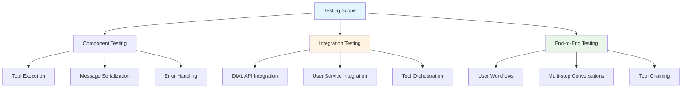

# Testing Guide

> Comprehensive testing strategies and procedures for validating DIAL Simple Agent functionality

## Table of Contents

- [Testing Overview](#testing-overview)
- [Test Environment Setup](#test-environment-setup)
- [Manual Testing Procedures](#manual-testing-procedures)
- [Integration Testing](#integration-testing)
- [Tool Testing](#tool-testing)
- [DIAL API Testing](#dial-api-testing)
- [Test Scenarios](#test-scenarios)
- [Validation Checklist](#validation-checklist)
- [Future Testing Strategy](#future-testing-strategy)

## Testing Overview

### Current Testing Approach

This project uses **manual testing** as the primary validation method. The focus is on:
- Interactive REPL-based testing
- Tool integration validation
- DIAL API response verification
- User service CRUD operation testing

### Testing Scope



### Test Coverage Matrix

| Component | Manual Test | Integration Test | Unit Test | Coverage |
|-----------|-------------|------------------|-----------|----------|
| DialClient | ✅ | ✅ | ❌ | Medium |
| BaseTool | ✅ | ✅ | ❌ | Medium |
| User Tools | ✅ | ✅ | ❌ | Medium |
| WebSearchTool | ✅ | ✅ | ❌ | Medium |
| UserClient | ✅ | ✅ | ❌ | Medium |
| Message/Conversation | ✅ | ❌ | ❌ | Low |
| App REPL | ✅ | ❌ | ❌ | Low |

**Legend:**
- ✅ Implemented
- ❌ Not implemented (future enhancement)

## Test Environment Setup

### Prerequisites

1. **Running Services:**
   ```bash
   # Start user service
   docker-compose up -d userservice
   
   # Verify health
   curl http://localhost:8041/health
   ```

2. **Environment Variables:**
   ```bash
   export DIAL_API_KEY="your-test-api-key"
   ```

3. **VPN Connection:**
   ```bash
   ping ai-proxy.lab.epam.com
   ```

### Test Data Preparation

The user service generates 1000 mock users on startup. To reset test data:

```bash
# Stop and remove container
docker-compose down userservice

# Remove persisted data (if using volumes)
rm -rf ./data

# Restart with fresh data
docker-compose up -d userservice
```

### Test User IDs

Sample user IDs for testing:
- User 1-1000: Auto-generated mock users
- Use `search_users` to find specific test users

## Manual Testing Procedures

### Test Session Setup

```bash
# 1. Activate environment
source dial_simple_agent/bin/activate

# 2. Start services
docker-compose up -d userservice

# 3. Set API key
export DIAL_API_KEY="your-key"

# 4. Run agent
python -m task.app
```

### Basic Functionality Tests

#### Test 1: Agent Startup

**Objective:** Verify agent initializes correctly

**Procedure:**
```bash
python -m task.app
```

**Expected Output:**
```
DIAL Endpoint: https://ai-proxy.lab.epam.com/openai/deployments/gpt-4o/chat/completions
Tools: ['web_search_tool', 'get_user_by_id', 'search_users', 'add_user', 'update_user', 'delete_user']
User Management Agent started. Type 'exit' or 'quit' to stop.
============================================================
> 
```

**Pass Criteria:**
- ✅ No errors during startup
- ✅ All 6 tools registered
- ✅ REPL prompt appears

#### Test 2: Simple Query

**Objective:** Verify basic AI response without tools

**Input:**
```
> What can you help me with?
```

**Expected:**
- AI describes user management capabilities
- Lists available operations (search, create, update, delete)
- No tool calls (informational response)

**Pass Criteria:**
- ✅ Response received within 5 seconds
- ✅ Response mentions user management features

#### Test 3: Exit Command

**Objective:** Verify graceful shutdown

**Input:**
```
> exit
```

**Expected:**
```
Goodbye!
```

**Pass Criteria:**
- ✅ Agent terminates cleanly
- ✅ "Goodbye!" message displayed
- ✅ No Python exceptions

### Tool Invocation Tests

#### Test 4: Search Users by Name

**Objective:** Verify search_users tool execution

**Input:**
```
> Find users named John
```

**Expected Behavior:**
1. AI invokes `search_users` tool with `name="John"`
2. Tool returns markdown-formatted user list
3. AI synthesizes natural language response

**Expected Output Pattern:**
```
I found [N] users named John:

1. John Smith (john.smith@example.com)
2. John Doe (john.doe@example.com)
...
```

**Pass Criteria:**
- ✅ Tool call visible in debug output (if enabled)
- ✅ Results formatted as readable list
- ✅ At least 1 user found

#### Test 5: Get User by ID

**Objective:** Verify get_user_by_id tool execution

**Input:**
```
> Show me details for user ID 1
```

**Expected:**
- Single user details displayed
- Includes: name, email, phone, company, etc.
- Markdown formatting

**Pass Criteria:**
- ✅ User data returned
- ✅ All fields present (name, email, etc.)
- ✅ No "user not found" error

#### Test 6: Create User

**Objective:** Verify add_user tool execution

**Input:**
```
> Create a new user: name Alice, surname Johnson, email alice.j@example.com, about_me "Software Engineer"
```

**Expected:**
- AI invokes `add_user` with required fields
- New user created in service
- Confirmation with user details returned

**Pass Criteria:**
- ✅ Success message received
- ✅ New user ID returned
- ✅ User can be retrieved with get_user_by_id

**Verification:**
```
> Get user ID [returned_id]
```

#### Test 7: Update User

**Objective:** Verify update_user tool execution

**Input:**
```
> Update user 1 email to newemail@example.com
```

**Expected:**
- AI invokes `update_user` with user_id and email fields
- User service updates record
- Updated user details returned

**Pass Criteria:**
- ✅ Update confirmation received
- ✅ Updated field reflected in response
- ✅ Other fields unchanged

**Verification:**
```
> Show user 1 details
```

#### Test 8: Delete User

**Objective:** Verify delete_user tool execution

**Input:**
```
> Delete user ID 999
```

**Expected:**
- AI may ask for confirmation (depending on prompt)
- `delete_user` tool invoked
- Success message returned

**Pass Criteria:**
- ✅ Deletion confirmed
- ✅ User no longer retrievable

**Verification:**
```
> Get user 999
# Expected: "User not found" error
```

#### Test 9: Web Search

**Objective:** Verify web_search_tool execution

**Input:**
```
> Search the web for information about EPAM Systems
```

**Expected:**
- `web_search_tool` invoked via Gemini 2.5 Pro
- Google Search results returned
- AI synthesizes information

**Pass Criteria:**
- ✅ Search results received
- ✅ Relevant information about EPAM
- ✅ No connection errors

## Integration Testing

### DIAL API Integration Tests

#### Test 10: Model Switching

**Objective:** Verify different models work correctly

**Procedure:**
1. Edit [app.py](../task/app.py):
   ```python
   deployment_name="gemini-2.5-pro"
   ```
2. Run agent and test basic query

**Pass Criteria:**
- ✅ Agent starts with Gemini model
- ✅ Tool calls work correctly
- ✅ Responses are coherent

#### Test 11: Tool Calling Loop

**Objective:** Verify recursive tool calling

**Input:**
```
> Find user named John Smith and update his email to john.new@example.com
```

**Expected Flow:**
1. AI calls `search_users(name="John", surname="Smith")`
2. AI receives user ID from results
3. AI calls `update_user(user_id=X, email="john.new@example.com")`
4. AI synthesizes final response

**Pass Criteria:**
- ✅ Multiple tool calls in sequence
- ✅ Context maintained between calls
- ✅ Final response confirms both operations

#### Test 12: Error Recovery

**Objective:** Verify graceful error handling

**Input:**
```
> Get user ID 999999
```

**Expected:**
- Tool returns error message
- AI communicates error to user naturally
- No Python exceptions raised

**Pass Criteria:**
- ✅ Error message from tool captured
- ✅ AI responds with "user not found" message
- ✅ Agent continues functioning

### User Service Integration Tests

#### Test 13: CRUD Cycle

**Objective:** Complete create-read-update-delete cycle

**Procedure:**
```
1. > Create user: name Test, surname User, email test@example.com, about_me "Test user"
   # Note returned ID

2. > Get user ID [id]
   # Verify data

3. > Update user [id] email to updated@example.com
   # Verify update

4. > Search for user with email updated@example.com
   # Verify search finds updated user

5. > Delete user [id]
   # Cleanup

6. > Get user [id]
   # Verify deletion
```

**Pass Criteria:**
- ✅ All operations succeed
- ✅ Data consistency maintained
- ✅ Final get returns "not found"

#### Test 14: Search Filters

**Objective:** Verify search parameter combinations

**Test Cases:**
```
1. > Search users with name John
2. > Search users with surname Smith
3. > Search users with gender male
4. > Search users with name John and surname Smith
5. > Search users with email containing @example.com
```

**Pass Criteria:**
- ✅ Each filter returns relevant results
- ✅ Combined filters narrow results appropriately
- ✅ Partial matches work for name/surname/email

#### Test 15: Pagination/Limits

**Objective:** Verify limit parameter

**Input:**
```
> Find the first 5 users
```

**Expected:**
- AI uses `limit=5` parameter
- Exactly 5 users returned

**Pass Criteria:**
- ✅ Result count matches limit
- ✅ Results are valid users

## Tool Testing

### Tool Schema Validation

#### Test 16: Schema Generation

**Objective:** Verify Pydantic models generate correct schemas

**Procedure:**
```python
from task.tools.users.models.user_info import UserCreate

schema = UserCreate.model_json_schema()
print(schema)
```

**Expected:**
```json
{
  "type": "object",
  "properties": {
    "name": {"type": "string"},
    "surname": {"type": "string"},
    "email": {"type": "string"},
    "about_me": {"type": "string"},
    ...
  },
  "required": ["name", "surname", "email", "about_me"]
}
```

**Pass Criteria:**
- ✅ All fields present in schema
- ✅ Required fields marked correctly
- ✅ Types match model definitions

### Tool Registration Tests

#### Test 17: Tool Discovery

**Objective:** Verify all tools are registered

**Procedure:**
```python
# In app.py, add debug output
print(f"Registered tools: {[t.name for t in tools]}")
```

**Expected:**
```
['web_search_tool', 'get_user_by_id', 'search_users', 'add_user', 'update_user', 'delete_user']
```

**Pass Criteria:**
- ✅ All 6 tools present
- ✅ No duplicate names
- ✅ Names match tool definitions

## DIAL API Testing

### Connection Tests

#### Test 18: VPN Requirement

**Objective:** Verify VPN dependency

**Procedure:**
1. Disconnect from EPAM VPN
2. Run agent and make query

**Expected:**
- Connection timeout or DNS error
- Clear error message

**Pass Criteria:**
- ✅ Error indicates connection issue
- ✅ No misleading messages

#### Test 19: Invalid API Key

**Objective:** Verify authentication handling

**Procedure:**
```bash
export DIAL_API_KEY="invalid-key"
python -m task.app
```

**Input:**
```
> Test query
```

**Expected:**
- HTTP 401/403 error
- Error message displayed

**Pass Criteria:**
- ✅ Authentication error caught
- ✅ Agent handles error gracefully

## Test Scenarios

### End-to-End Scenarios

#### Scenario 1: User Onboarding Workflow

**Description:** Complete new user setup

**Steps:**
```
1. User: "I need to add a new employee"
   AI: Asks for required information

2. User: "Name: Sarah Wilson, email: sarah.w@company.com, role: Data Scientist"
   AI: Creates user, confirms details

3. User: "Search for Sarah"
   AI: Finds newly created user

4. User: "Update Sarah's email to sarah.wilson@company.com"
   AI: Updates email, confirms change
```

**Pass Criteria:**
- ✅ Natural conversation flow
- ✅ AI handles incomplete information
- ✅ All operations succeed

#### Scenario 2: User Lookup and Enrichment

**Description:** Find user and add web-sourced information

**Steps:**
```
1. User: "Find John Smith"
   AI: Returns user details

2. User: "Search the web for John Smith EPAM"
   AI: Uses web search tool

3. User: "Update John's about_me with this information"
   AI: Updates user profile
```

**Pass Criteria:**
- ✅ Multi-tool orchestration works
- ✅ Context maintained across tools
- ✅ Information correctly transferred

#### Scenario 3: Batch Operations

**Description:** Operate on multiple users

**Steps:**
```
1. User: "Find all users with surname Johnson"
   AI: Returns list of Johnson users

2. User: "Update all their company to EPAM"
   AI: Iterates through users, updates each
```

**Pass Criteria:**
- ✅ AI handles multiple tool calls
- ✅ Progress communicated to user
- ✅ All updates succeed

## Validation Checklist

### Pre-Release Validation

- [ ] **Environment Setup**
  - [ ] Virtual environment activates
  - [ ] Dependencies installed
  - [ ] Docker containers start

- [ ] **DIAL API Connectivity**
  - [ ] VPN connection verified
  - [ ] API key authentication works
  - [ ] Models respond correctly

- [ ] **User Service**
  - [ ] Container healthy
  - [ ] All endpoints accessible
  - [ ] CRUD operations work

- [ ] **Tool Functionality**
  - [ ] All 6 tools registered
  - [ ] Schemas generated correctly
  - [ ] Tool execution returns results

- [ ] **Agent Behavior**
  - [ ] Startup without errors
  - [ ] Basic queries answered
  - [ ] Tool calls executed
  - [ ] Multi-step workflows succeed
  - [ ] Error handling graceful
  - [ ] Exit command works

- [ ] **Data Integrity**
  - [ ] Create-read-update-delete cycle
  - [ ] Search filters work
  - [ ] Updates persist
  - [ ] Deletions complete

- [ ] **Error Scenarios**
  - [ ] Invalid user IDs handled
  - [ ] Network errors caught
  - [ ] Invalid input rejected
  - [ ] Graceful degradation

### Regression Testing

After code changes, verify:

- [ ] Existing test scenarios still pass
- [ ] No new errors in logs
- [ ] Tool registration unchanged
- [ ] Message serialization correct
- [ ] Conversation history maintained

## Future Testing Strategy

### Planned Enhancements

#### Unit Testing Framework

```python
# tests/test_tools.py
import pytest
from task.tools.users.create_user_tool import CreateUserTool
from task.tools.users.user_client import UserClient

def test_create_user_tool():
    client = UserClient()
    tool = CreateUserTool(client)
    
    result = tool.execute({
        "name": "Test",
        "surname": "User",
        "email": "test@example.com",
        "about_me": "Test user"
    })
    
    assert "Test User" in result
```

**To Run:**
```bash
pip install pytest
pytest tests/
```

#### Integration Test Suite

```python
# tests/test_integration.py
def test_dial_api_integration():
    """Test full DIAL API request-response cycle"""
    pass

def test_user_service_integration():
    """Test user service CRUD operations"""
    pass

def test_tool_orchestration():
    """Test multi-tool agentic workflows"""
    pass
```

#### Automated Testing CI/CD

```yaml
# .github/workflows/test.yml
name: Test Suite

on: [push, pull_request]

jobs:
  test:
    runs-on: ubuntu-latest
    steps:
      - uses: actions/checkout@v2
      - name: Start user service
        run: docker-compose up -d userservice
      - name: Run tests
        run: pytest tests/
        env:
          DIAL_API_KEY: ${{ secrets.DIAL_API_KEY }}
```

#### Load Testing

```python
# tests/test_load.py
import concurrent.futures
from task.client import DialClient

def test_concurrent_requests():
    """Test agent under concurrent load"""
    client = DialClient(...)
    
    with concurrent.futures.ThreadPoolExecutor(max_workers=10) as executor:
        futures = [
            executor.submit(client.get_completion, messages)
            for _ in range(100)
        ]
        results = [f.result() for f in futures]
    
    assert len(results) == 100
```

### Test Coverage Goals

| Component | Current | Target |
|-----------|---------|--------|
| DialClient | 0% | 80% |
| Tools | 0% | 90% |
| UserClient | 0% | 85% |
| Models | 0% | 70% |
| App REPL | 0% | 50% |

---

**Last Updated**: 2025-12-30 | **Version**: 1.0.0 | **Test Coverage**: Manual only

## Quick Test Commands

```bash
# Basic smoke test
python -m task.app <<EOF
search users named John
exit
EOF

# Docker health check
docker-compose ps
curl http://localhost:8041/health

# API connectivity
curl -X POST https://ai-proxy.lab.epam.com/openai/deployments/gpt-4o/chat/completions \
  -H "api-key: $DIAL_API_KEY" \
  -H "Content-Type: application/json" \
  -d '{"messages": [{"role": "user", "content": "test"}]}'
```
